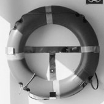

# Image Processing with OpenCL

A modular C++ and OpenCL-based project for performing image processing operations such as cropping, grayscale conversion, and halftone effects. The project is designed to be extensible, allowing easy addition of new image processing kernels.

## Features
- Modular architecture with reusable OpenCL management and processor classes.
- Supports multiple image processing operations:
  - Crop: Extract a region from an input image.
  - Grayscale: Convert an image to grayscale using weighted RGB values.
  - Halftone: Apply a halftone effect using a threshold matrix.
- Easy-to-extend framework for adding new processors.
- Unit tests for validating processor functionality.
- Cross-platform support via OpenCL.

## Prerequisites
- **CMake** 3.10 or higher
- **OpenCL SDK** (e.g., NVIDIA CUDA, Intel OpenCL, AMD ROCm)
- **C++17** compatible compiler (e.g., GCC, Clang, MSVC)
- **Optional**:
  - **OpenImageIO** for image input/output (or use stb_image for lightweight I/O)
  - **Google Test** for running unit tests

## Installation

1. **Clone the repository**:
   ```bash
   git clone https://github.com/solidironmeat/opencl-image-processing.git
   cd opencl-image-processing
   ```

2. **Create a build directory**:
   ```bash
   mkdir build
   cd build
   ```

3. **Run CMake**:
   ```bash
   cmake ..
   ```

4. **Build the project**:
   ```bash
   make
   ```

## Usage

1. **Run the main application**:
   ```bash
   ./image_processing resources/input.png 
   ```
   The default `main.cpp` demonstrates a pipeline of crop, grayscale, and halftone operations on a sample image (if image I/O is configured).

   **Input**:

   

   **Outputs**:

   
   
   


   <!-- 
   
    -->

2. **Run unit tests** (if Google Test is installed):
   ```bash
   make test
   ```

3. **Process an image**:
   - Place your input image in the `resources/` directory.
   - Modify `main.cpp` to load your image using OpenImageIO or stb_image and apply desired processors.
   - Rebuild and run the application.

Example `main.cpp` snippet:
```cpp
#include "opencl_manager.hpp"
#include "processors/crop_processor.hpp"
#include "processors/grayscale_processor.hpp"
#include "processors/halftone_processor.hpp"

int main() {
    OpenCLManager manager;
    std::vector<cl_uchar4> input_array; // Load your image data
    uint32_t width = 1920, height = 1080;

    CropProcessor cropper(manager);
    auto cropped = cropper.process(input_array, width, height, 1280, 720, 100, 100);

    GrayscaleProcessor grayscaler(manager);
    auto grayed = grayscaler.process(cropped, 1280, 720, 1280, 720);

    HalftoneProcessor halftoner(manager);
    auto halftoned = halftoner.process(grayed, 1280, 720, 1280, 720);

    // Save or display the result
    return 0;
}
```

## Project Structure
```
image_processing_opencl/
├── include/                # Header files
│   ├── opencl_manager.hpp
│   ├── image_processor.hpp
│   ├── processors/         # Processor-specific headers
├── src/                    # Source files
│   ├── opencl_manager.cpp
│   ├── image_processor.cpp
│   ├── processors/         # Processor implementations
│   ├── main.cpp
├── kernels/                # OpenCL kernel files (.cl)
├── tests/                  # Unit tests
├── resources/              # Sample images
├── build/                  # Build artifacts
├── CMakeLists.txt          # Build configuration
├── README.md               # This file
├── LICENSE                 # License file
└── .gitignore              # Git ignore rules
```

## Adding a New Processor
To add a new image processing operation (e.g., blur):
1. Create `*include/processors/blur_processor.hpp`* with a class inheriting from `ImageProcessor`.
2. Implement the processor in `*src/processors/blur_processor.cpp`*.
3. Add a kernel file `*kernels/blur.cl`* with the OpenCL kernel code.
4. Update `CMakeLists.txt` to include the new source file:
   ```cmake
   set(SOURCES
       # Existing sources
       src/processors/blur_processor.cpp
   )
   ```
5. Add a test file `*tests/test_blur.cpp`*.
6. Rebuild and test the project.

## Dependencies
- **OpenCL**: Required for GPU/CPU parallel processing.
- **OpenImageIO** (optional): For robust image I/O. Alternatively, use stb_image (header-only).
- **Google Test** (optional): For unit testing.

To install dependencies on Ubuntu:
```bash
sudo apt-get install libopencl1 ocl-icd-opencl-dev libopenimageio-dev openimageio-tools googletest
```

## Building with Dependencies
- If OpenImageIO is not installed, the project builds without image I/O support. Use stb_image or manual pixel data for testing.
- If Google Test is not installed, tests are skipped.

## Contributing
1. Fork the repository.
2. Create a feature branch (`git checkout -b feature/new-processor`).
3. Commit changes (`git commit -m "Add blur processor"`).
4. Push to the branch (`git push origin feature/new-processor`).
5. Open a pull request.
